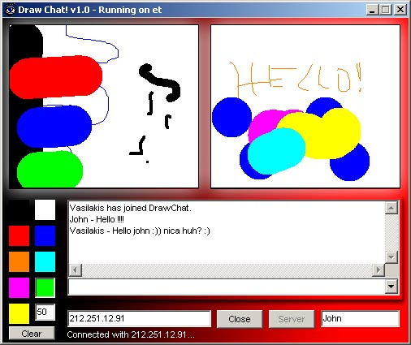



## Draw Chat\!\!\!  Drawing through a connection \(winsock\)

### Description

This program can be a server (single client) or a client to connect to the other side who has this program. Draw and chat together and the other side can see what you draw!!! Really COOL and FUN!!! :-)
 
### More Info
 

             |
---                |---
**Submitted On**   |2000-06-25 10:05:24
**By**             |[vasilakis](https://github.com/Planet-Source-Code/PSCIndex/blob/master/ByAuthor/vasilakis.md)
**Level**          |Intermediate
**User Rating**    |4.6 (23 globes from 5 users)
**Compatibility**  |VB 3\.0, VB 4\.0 \(16\-bit\), VB 4\.0 \(32\-bit\), VB 5\.0, VB 6\.0, VB Script, ASP \(Active Server Pages\) 
**Category**       |[Internet/ HTML](https://github.com/Planet-Source-Code/PSCIndex/blob/master/ByCategory/internet-html__1-34.md)
**World**          |[Visual Basic](https://github.com/Planet-Source-Code/PSCIndex/blob/master/ByWorld/visual-basic.md)
**Archive File**   |[CODE\_UPLOAD71246252000\.zip](https://github.com/Planet-Source-Code/vasilakis-draw-chat-drawing-through-a-connection-winsock__1-9238/archive/master.zip)

### API Declarations

The are no DLLS or OCX Needed! Just Winsock :)

